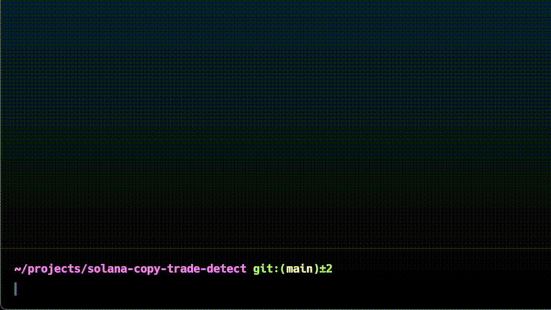
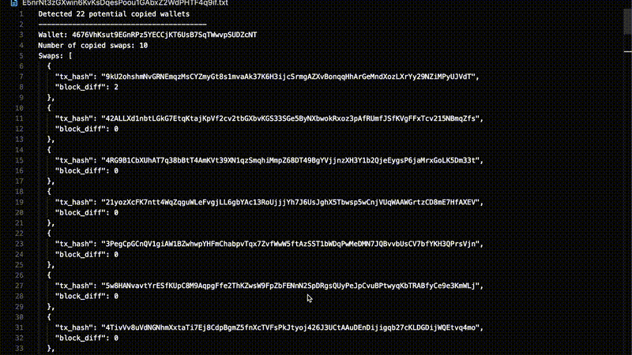

# Solana Copy Trade Detect

[](https://github.com/0xRustPro/solana-copy-trade-detect/actions/workflows/ci.yml)

A CLI tool to detect if a Solana wallet is copy trading other wallets. Find profitable wallets and analyze if they're copying others to stay ahead of the competition.

## What It Does

This tool analyzes a target wallet's recent trades and identifies other wallets that made similar trades before it, helping you understand copy trading patterns in the Solana ecosystem.

## Quick Start

### 1. Get API Keys
- **Cielo**: [Get free API key](https://build.cielo.finance/my-dashboard/plans)
- **Shyft**: [Get free API key](https://shyft.to/dashboard/overview)

### 2. Add Wallet to Cielo Watchlist
The wallet you want to scan must be in your Cielo watchlist first.

### 3. Run the Tool

```bash
# Basic usage
solana-copy-trade-detect \
  --cielo-api-key YOUR_CIELO_KEY \
  --shyft-api-key YOUR_SHYFT_KEY \
  --wallet WALLET_ADDRESS_TO_SCAN

# With custom settings
solana-copy-trade-detect \
  --cielo-api-key YOUR_CIELO_KEY \
  --shyft-api-key YOUR_SHYFT_KEY \
  --wallet WALLET_ADDRESS_TO_SCAN \
  --swap-num 20 \
  --scan-tx-count 100
```

## Demo

**Command usage:**


**Output example:**


## Output Format

### Text Output (Terminal)
Results are saved to a text file with detected wallets and their transaction details.

### JSON Output (Piped)
When piped to another program, outputs JSON:

```json
[
  {
    "wallet": "CMcHRygKpNG2Jx83T1cTiqAvg55mYXv6uSwjhFzLwQFc",
    "txs": [
      {
        "tx_hash": "HM1SpwQku4TwjBzb99KvFTUM28P6qvXtsE9nx5ysXFHC2VpTn9zwSkQhu56FDVnTz9Y3W42FZCCQr5JVGX7ajmf",
        "block_diff": 0
      }
    ]
  }
]
```

**Fields:**
- `wallet`: Address of the wallet being copied
- `txs`: Array of copied transactions
- `tx_hash`: Transaction hash
- `block_diff`: Blocks between original and copy trade

## Installation

### Download Binary
Get pre-built binaries from [releases](https://github.com/0xRustPro/solana-copy-trade-detect/releases).

### Build from Source
```bash
git clone https://github.com/0xRustPro/solana-copy-trade-detect.git
cd solana-copy-trade-detect
cargo build --release
```

## Configuration Options

```bash
solana-copy-trade-detect --help
```

**Key Options:**
- `--wallet`: Wallet address to scan (required)
- `--swap-num`: Number of recent swaps to analyze (default: 15, max: 100)
- `--scan-tx-count`: Transactions to scan per swap (default: 50, max: 100)
- `--delay-ms`: Delay between API requests (default: 500ms)
- `--output-file`: Custom output file path

**Environment Variables:**
- `CIELO_API_KEY`: Your Cielo API key
- `SHYFT_API_KEY`: Your Shyft API key
- `RPC_URL`: Custom Solana RPC endpoint

## How It Works

1. **Fetch Recent Swaps**: Gets recent swap transactions from Cielo API
2. **Analyze History**: For each swap, examines token transaction history
3. **Detect Patterns**: Finds wallets that bought the same token before
4. **Calculate Timing**: Measures block differences between trades
5. **Report Results**: Lists wallets with multiple copy trades

## Requirements

- Cielo API key (free tier available)
- Shyft API key (free tier available)
- Target wallet must be in your Cielo watchlist
- Rust (if building from source)


